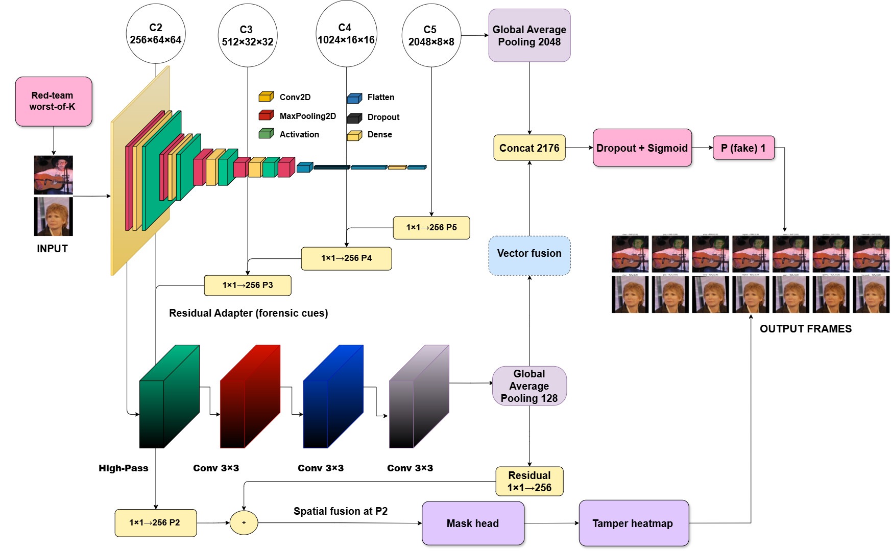
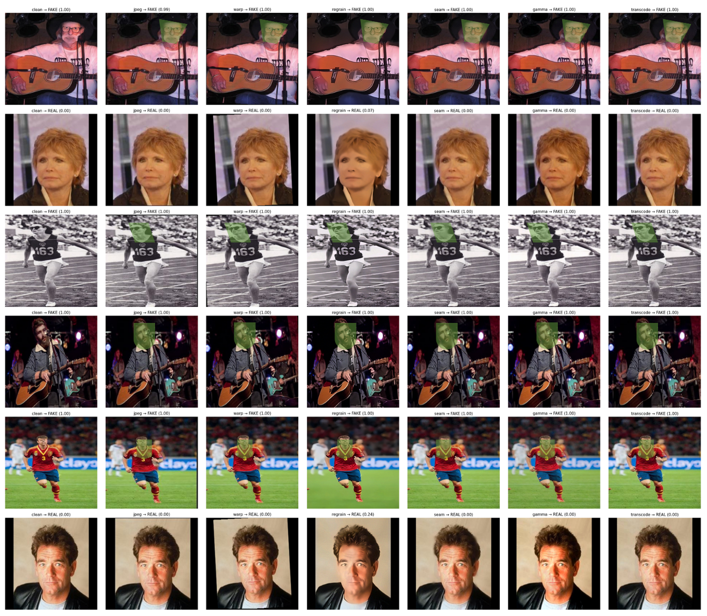

<h1 align="center">Attack-Aware Deepfake Detection under Counter-Forensic Manipulations</h1>

<p align="center">
  <b>Noor Fatima</b><sup>1</sup> &nbsp;
  <b>Hasan Faraz Khan</b><sup>1</sup> &nbsp;
  <b><a href="https://muzammilbehzad.com/">Muzammil Behzad</a></b><sup>1,2</sup>
</p>

<p align="center">
  <sup>1</sup>King Fahd University of Petroleum &amp; Minerals, Saudi Arabia<br>
  <sup>2</sup>SDAIA-KFUPM Joint Research Center for Artificial Intelligence, Saudi Arabia
</p>

<p align="center">
  <b>Corresponding author:</b>
  <a href="mailto:muzammil.behzad@kfupm.edu.sa">Muzammil Behzad</a>
</p>

<p align="center">
  <a href="#abstract">Abstract</a> &nbsp;|&nbsp;
  <a href="#installation">Installation</a> &nbsp;|&nbsp;
  <a href="#quick-start">Quick Start</a> &nbsp;|&nbsp;
  <a href="#training">Training</a> &nbsp;|&nbsp;
  <a href="#evaluation">Evaluation</a> &nbsp;|&nbsp;
  <a href="#quantitative-results">Results</a> &nbsp;|&nbsp;
  <a href="#repository-structure">Repository Structure</a>
</p>

<p align="center">
  
  
</p>

<p align="center">
  
</p>
<p align="center">
  <sub>Overview of the attack-aware dual-stream architecture, worst-of-<i>K</i> training, and weakly supervised evidence localization.</sub>
</p>

---

## Abstract

The rapid proliferation of AI-generated and manipulated visual content requires forensic detectors that remain reliable after routine processing and deliberate counter-forensic modification. This paper presents an attack-aware deepfake detector that combines pretrained semantic features with fixed forensic residual responses through a lightweight fusion module and produces weakly supervised spatial evidence maps. During training, a worst-of-*K* strategy selects the most damaging transformation from sampled JPEG compression, resampling, regraining, seam processing, color adjustment, and transcoding operations. At inference, predictions from low-cost randomized views are aggregated to reduce sensitivity to processing variations while preserving localized evidence. On the held-out DeepFakeFace split, the proposed framework achieved a worst-case accuracy of 0.9917 using a single validation-selected operating point. Regrain was the most challenging condition and produced an expected calibration error of 0.0196. Five independently seeded runs, controlled component analyses, and matched ResNet-50 and Xception comparisons were used to assess stability and robustness. The experiments identify worst-of-*K* exposure as the main contributor to counter-forensic operating robustness, while the semantic stream provides the strongest standalone representation and the residual stream remains independently predictive. The resulting heatmaps indicate where forensic evidence is concentrated without requiring pixel-accurate manipulation masks.

## Key Contributions

- An attack-aware training strategy that selects the most damaging counter-forensic transformation from a sampled attack pool for each mini-batch.
- A dual-stream detector that combines ImageNet-pretrained semantic features with fixed high-pass forensic residual responses.
- A lightweight FPN-style mask head that produces weakly supervised spatial evidence maps without requiring pixel-accurate manipulation masks.
- Randomized test-time aggregation that averages classification logits and preserves localized evidence through pixelwise maximum aggregation.
- Matched evaluation across clean images and six counter-forensic conditions: JPEG, Warp, Regrain, Seam, Gamma, and Transcode.

## Method Overview

The model processes each image through two complementary streams. A ResNet-50 content stream captures semantic information, while a fixed five-kernel high-pass bank produces a 15-channel residual representation for forensic analysis. The pooled content and residual features are fused for binary classification, and multiscale content features are combined with residual features by the FPN-style localization head.

During training, candidate counter-forensic transformations are sampled from the attack pool. The candidate that produces the largest mean batch classification loss is selected, and the model is optimized on that attacked view using classification, weak-mask, edge, size, and cross-view consistency terms. During evaluation, low-cost randomized views are aggregated by averaging classification logits and taking the elementwise maximum of the predicted evidence maps.

## Installation

The code is designed for Linux and Windows through WSL. An NVIDIA GPU is strongly recommended for training, although evaluation can also run on CPU.

### 1. Clone the repository

```bash
git clone https://github.com/BRAIN-Lab-AI/Attack-Aware-Deepfake-Detection.git
cd Attack-Aware-Deepfake-Detection
```

### 2. Create and activate a Python environment

Using Conda:

```bash
conda create -n deepfake-detection python=3.10 -y
conda activate deepfake-detection
```

Alternatively, using `venv` inside WSL:

```bash
python3 -m venv .venv
source .venv/bin/activate
python -m pip install --upgrade pip
```

### 3. Install the dependencies

```bash
pip install -r requirements.txt
pip install -e . --no-deps
```

The dependency versions reproduce the software configuration used by the supplied implementation. The pretrained ResNet-50 weights and InsightFace `buffalo_l` assets are downloaded automatically when first required.

## Quick Start

The complete FAST workflow can be run in two commands:

```bash
python scripts/download_data.py \
  --mode FAST \
  --data-root data

python scripts/train.py \
  --mode FAST \
  --data-root data \
  --output-dir outputs
```

The second command trains the model, evaluates it on the clean test split and all six attacks, evaluates the surveillance-style condition, and saves the final checkpoint and metrics.

For a single-command run that downloads the data before training:

```bash
python scripts/train.py \
  --mode FAST \
  --data-root data \
  --output-dir outputs \
  --download
```

## Dataset Preparation

The implementation downloads images from the following Hugging Face datasets:

| Dataset | Repository ID | Label | Role |
|:---|:---|:---:|:---|
| DeepFakeFace | `OpenRL/DeepFakeFace` | 1 | Manipulated/fake images |
| CelebA Faces | `nielsr/CelebA-faces` | 0 | Real images |

Download and cache the FAST configuration:

```bash
python scripts/download_data.py \
  --mode FAST \
  --data-root data
```

Download and cache the larger PRO configuration:

```bash
python scripts/download_data.py \
  --mode PRO \
  --data-root data
```

The generated directory layout is:

```text
data/
├── fake/
├── real/
└── mask_cache/
```

The face-region priors are generated with InsightFace when available, followed by MediaPipe and center-region fallbacks. Computed priors are cached under `mask_cache/`.

## Experiment Modes

| Setting | FAST | PRO |
|:---|---:|---:|
| Fake images | 800 | 4,000 |
| Real images | 800 | 4,000 |
| Epochs | 2 | 5 |
| Batch size | 32 | 48 |
| Test-time views | 3 | 5 |

The default mode is `FAST`. The image working resolution is 256 × 256, the random seed is 2025, and the validation and test fractions are both 0.15.

## Training

Train the FAST configuration:

```bash
python scripts/train.py \
  --mode FAST \
  --data-root data \
  --output-dir outputs
```

Train the PRO configuration:

```bash
python scripts/train.py \
  --mode PRO \
  --data-root data \
  --output-dir outputs
```

To train and save the checkpoint without running the final test suite:

```bash
python scripts/train.py \
  --mode FAST \
  --data-root data \
  --output-dir outputs \
  --skip-test
```

Training writes the following files:

```text
outputs/
├── model.pt
└── metrics.json
```

The checkpoint contains the model state, optimizer state, experiment configuration, and epoch-level validation history. `metrics.json` contains clean, attack-specific, summary, and surveillance metrics.

## Evaluation

Evaluate a saved checkpoint using the same mode and data root used during training:

```bash
python scripts/evaluate.py \
  outputs/model.pt \
  --mode FAST \
  --data-root data \
  --output outputs/metrics.json
```

To skip attack-level mask IoU computation during a faster robustness evaluation:

```bash
python scripts/evaluate.py \
  outputs/model.pt \
  --mode FAST \
  --data-root data \
  --output outputs/metrics.json \
  --no-attack-iou
```

The evaluation suite reports:

- ROC AUC, average precision, accuracy, and expected calibration error on clean data.
- Accuracy, ROC AUC, and calibration under all six counter-forensic attacks.
- Hard IoU at a 0.3 prediction threshold and Soft-IoU for weak localization.
- Worst-case accuracy, worst-case AUC, and per-attack AUC changes relative to clean evaluation.
- Performance under the surveillance-style low-light, blur, and recompression transformation.

## Quantitative Results

The following tables present a compact selection of the quantitative results reported in the manuscript. They summarize robustness across counter-forensic transformations, comparison with standard clean-trained baselines, and the contribution of the proposed components.

<p align="center">
  
</p>

<p align="center">
  <sub>Representative detection predictions and spatial evidence maps under clean and counter-forensic conditions.</sub>
</p>

### Robustness under counter-forensic transformations

The detector maintains complete ranking separation on the matched clean and attacked evaluation sets. Regrain is the most challenging condition in terms of calibration.

| Condition | ROC AUC | Average Precision | ECE ↓ |
|:---|---:|---:|---:|
| Clean | 1.0000 | 1.0000 | 0.0008 |
| JPEG | 1.0000 | 1.0000 | 0.0039 |
| Warp | 1.0000 | 1.0000 | 0.0013 |
| Regrain | 1.0000 | 1.0000 | 0.0196 |
| Seam | 1.0000 | 1.0000 | 0.0007 |
| Gamma | 1.0000 | 1.0000 | 0.0007 |
| Transcode | 1.0000 | 1.0000 | 0.0018 |


### Comparison with clean-trained baselines

At the common decision threshold of 0.5, the proposed attack-aware model achieves the strongest clean and worst-attack accuracy among the evaluated models.

| Model | Clean Accuracy | Worst-Attack Accuracy |
|:---|---:|---:|
| ResNet-50 (clean training) | 0.9870 | 0.9333 |
| Xception (clean training) | 0.9813 | 0.8875 |
| **Proposed attack-aware model** | **0.9917** | **0.9542** |


### Component analysis

Removing worst-of-*K* training produces the largest deterioration in worst-attack accuracy and calibration, identifying attack-aware exposure as the main contributor to operating robustness.

| Variant | Clean AUC | Clean Accuracy | Worst-Attack AUC | Worst-Attack Accuracy | Maximum Attack ECE ↓ |
|:---|---:|---:|---:|---:|---:|
| **Full model** | 1.0000 | 0.9917 | 1.0000 | 0.9542 | 0.0358 |
| Content only | 1.0000 | 0.9958 | 1.0000 | 0.9542 | 0.0207 |
| Residual only | 0.9679 | 0.9125 | 0.9601 | 0.8833 | 0.2864 |
| Without worst-of-*K* | 1.0000 | 0.9917 | 0.9961 | 0.5375 | 0.3721 |
| Without TTA | 1.0000 | 1.0000 | 0.9999 | 0.9583 | 0.0266 |
| Without weak localization | 1.0000 | 0.9958 | 1.0000 | 0.9917 | 0.0275 |


Across five full-system runs, weak localization achieved an IoU@0.3 of **0.4988 ± 0.0300** and a Soft-IoU of **0.4502 ± 0.0217** against the weak face-region priors. These heatmaps indicate where forensic evidence is concentrated and should not be interpreted as pixel-accurate manipulation boundaries.

## Reproducibility

- The global random seed is fixed to `2025` for Python, NumPy, and PyTorch.
- Dataset shuffling and train/validation/test partitioning use the same fixed seed.
- Package versions are pinned in [`requirements.txt`](requirements.txt).
- Image normalization uses ImageNet mean and standard deviation.
- The attack family, transformation ranges, optimizer settings, loss coefficients, gradient clipping threshold, and randomized test-time aggregation follow the supplied implementation.
- Exact numerical results can vary across GPUs, CUDA/cuDNN versions, and nondeterministic backend operations.

## Repository Structure

```text
Attack-Aware-Deepfake-Detection/
├── assets/
│   └── architecture.png
├── scripts/
│   ├── download_data.py
│   ├── train.py
│   └── evaluate.py
├── src/unfooled/
│   ├── attacks.py
│   ├── config.py
│   ├── data.py
│   ├── evaluation.py
│   ├── losses.py
│   ├── masks.py
│   ├── model.py
│   ├── training.py
│   └── utils.py
├── .gitignore
├── pyproject.toml
├── requirements.txt
└── README.md
```

- **Data pipeline:** `data.py` downloads, caches, partitions, transforms, and loads the image datasets.
- **Weak localization:** `masks.py` detects face regions, applies fallbacks, softens priors, and manages the mask cache.
- **Counter-forensic attacks:** `attacks.py` implements JPEG, Warp, Regrain, Seam, Gamma, and Transcode transformations.
- **Architecture:** `model.py` defines the fixed high-pass bank, residual adapter, ResNet-50 content stream, classifier, and FPN-style mask head.
- **Optimization:** `losses.py` and `training.py` implement the loss terms, worst-of-*K* selection, mixed-precision optimization, and gradient clipping.
- **Evaluation:** `evaluation.py` implements randomized aggregation, classification metrics, calibration, localization metrics, attack evaluation, and surveillance-style evaluation.

## Acknowledgements

This work was supported by King Fahd University of Petroleum & Minerals (KFUPM) under grant numbers EC241013, IN26117 and INAI2605. The authors would also like to acknowledge the Saudi Data and AI Authority (SDAIA) and KFUPM through the SDAIA-KFUPM Joint Research Center for Artificial Intelligence for providing computational resources.
